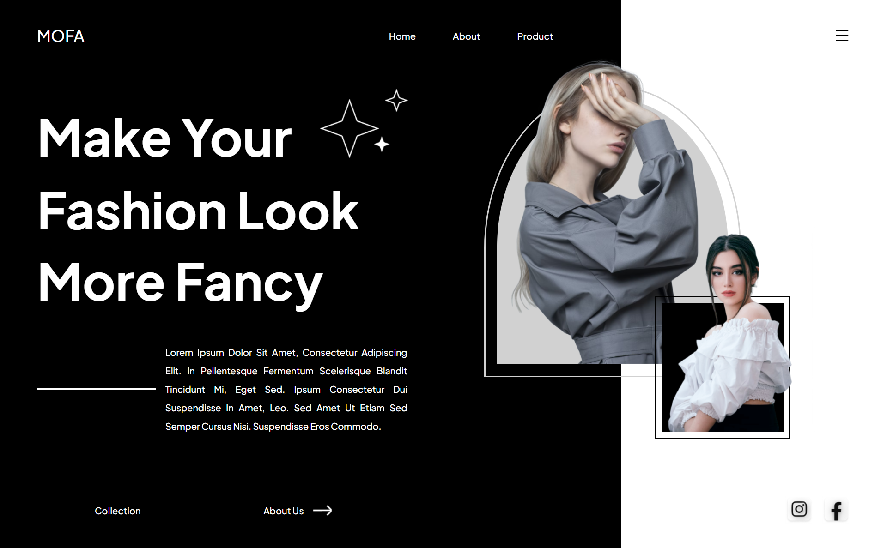

# Header for MOFA using React JS
This project is a single page web built with React JS framework. I created this project as an exercise to develop front end skills

## Table of contents

- [Overview](#overview)
  - [The challenge](#the-challenge)
  - [Screenshot](#screenshot)
  - [Links](#links)
  - [Credit](#credit)
- [My process](#my-process)
  - [Built with](#built-with)
  - [What I learned](#what-i-learned)
  - [Continued development](#continued-development)
  - [Useful resources](#useful-resources)
- [Author](#author)


## Overview

### The challenge

- Build out the project to the designs provided

### Screenshot



### Links
- [Live Site URL](https://mofa-home-page.vercel.app/)

### Credit
- [Figma Design i used for this project is created by Capi Creative](https://dribbble.com/shots/19624071-Mofa-Ecommerce-Hero-Section-Concept)

## My process

### Built with

- Semantic HTML5 markup
- CSS custom properties
- Flexbox
- [React JS](https://reactjs.org/) - JS library
- [React Icons](https://react-icons.github.io/react-icons/) - JS library to add icons


### What I learned

I learned how to code a design like the following image using css


Code snippets, see below:
```css
.outer-oval {
  border: 3px solid #D1D1D1;
  position: relative;
  top: 5%; 
  left: -50%;
  display: flex;
  justify-content: center;
  align-items: center;
  width: 440px;
  height: 500px;
  border-radius: 90% / 100%;
  border-bottom-left-radius: 0;
  border-bottom-right-radius: 0;
  z-index: 1;
}
.oval {
  display: flex;
  justify-content: center;
  background-color: #D1D1D1;
  width: 400px;
  height: 460px;
  border-radius: 90% / 100%;
  border-bottom-left-radius: 0;
  border-bottom-right-radius: 0;
  z-index: 2;
}
.oval img {
  position: relative;
  width: auto;
  height: 120%;
  bottom: 20%;
}
```


### Continued development
The development of this project will be continue by adding features to make the web responsive

### Useful resources
- [Dribble](https://dribbble.com/) - This website provide many UI/UX design some are free. I really liked this website and will use it going forward.


## Author

- Github - [Shabrina Putri](https://github.com/shabrina12/)
- Instagram - [@shabputri_](https://www.instagram.com/shabputri_/)
